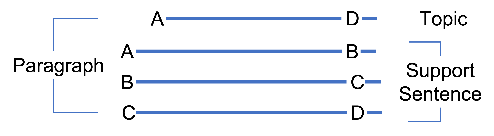

# Part 2 - Paragraph Writing

## 2.3 - Starting with a topic sentence/summary sentence
Main points: 
* Paragraph begins with a topic sentence
* With a topic sentense upfront, it helps reader decide whether to continue reading or not, the detail is also easy to understand
* Topic sentence shall be concrete and concise

### 2.3.1 - How to write

### 2.3.2 - Example

### 2.3.3 - Why is it important?
Starting with a topic sentense, it helps reader:
* Decide whether to skip reading the detail
* Understand easily the detail
* Confirm the correctness of the proof while reading

At the same, it helps writer:
* emphasize the impartant information

## 2.5 - Connecting paragraphes
Main points:
* Create a logical paragraph by connecting the vertical and horizontal part
* Clear connect from vertical and horizontal increase the logical flow of the sentence
* Connecting paragraph using topic sentense
  * If vertical, use handover type
  * If horizontal, use expansion type

## 2.7 - Connecting old to new information
Main points:
* Each sentence of the paragraph, start with old information and end with new information.
* By doing so, the flow of information get better, make it easier to understand since we read from beginning.
* From old to new information, there are three patterns.

### 2.7.4 - Tips
To connect old to new information in the paragraph, there are three patterns
* Handover type: vertical connection
* Expansion type: horizontal connection
* Unified type: both vertical and horizontal connection

#### Handover type
Use case: explaining process or procedures.

Example:

In writing, we should start writing from **summary** to **detail**. First, we state the **summary** by using a **topic sentence**. Then, contents of **topic sentence** is further breakdown into logical block called **paragraph**. After that, each **paragraph** shall start with a **summary sentence**. Finally, after each **summary sentence**, we complete the **detail** by adding additional supporting information. 

#### Expansion type
Use case: introduce element of organization, or feature of something

Example:

This robot take surrounding information by using optical, sound, and touch sensor.
1. Optical: add detail about Camera
2. Sound: add detail about stereo mic
3. Touch: add detail about touch sensor

#### Unified type
Use case: product or service introduction. By putting the produce or service name in front of sentence, we explain about it while making it memorable. 

Example:

TO DO 
